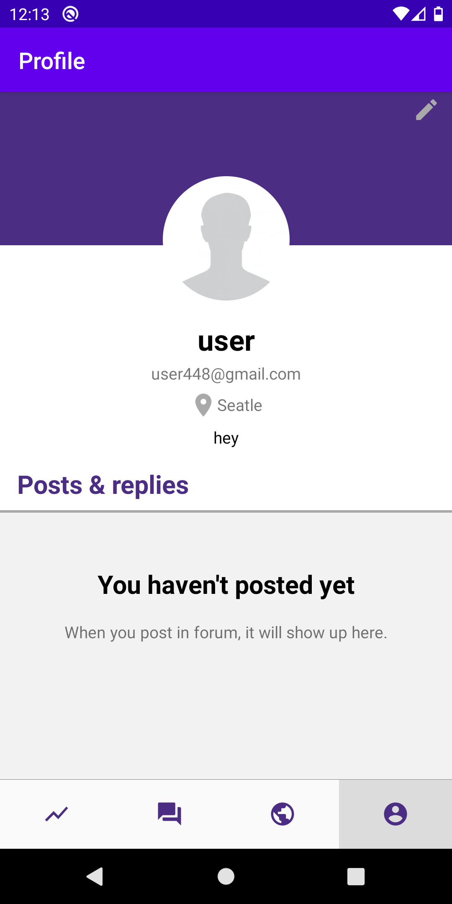
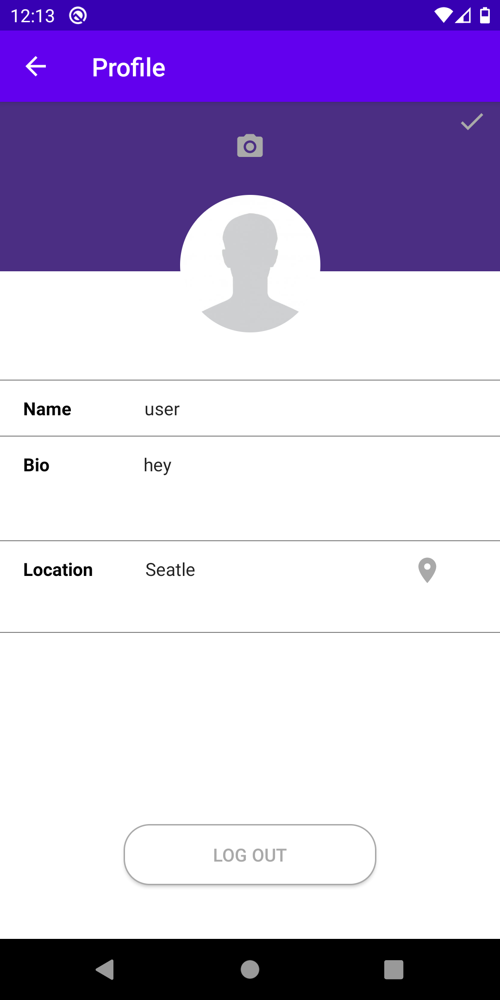

# Info448FinalProject
## C19-SUPPORT
An Android app for increasing community support and resilience in this time of plague, and facilitating mutual aid amongst neighbors

## Usage
COVID Stats tab - 
The users will be able to view real-time COVID statistics of the US
Users can also select on each state to view detailed data information

Forum tab - 
A forum where neighbors could make and share posts with their community

Health tab - 
The users could view health and safety tips regarding the virus. 

Profile tab - 
Users will be able to log in their account, view, and edit their profile.
Users will also be able to see their posts and replies in the profile tab. 

## Screens

    

